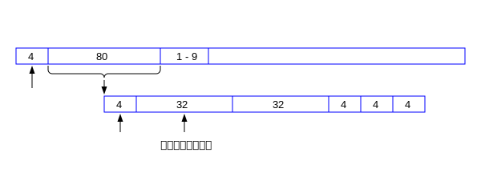

# BitCoin 介绍

### 比特币的地址

 <!-- 比特币的地址 -->


```cpp
/* in src/primitives/block.h */
class CBlockHeader
{
public:
    // header
    int32_t nVersion;
    uint256 hashPrevBlock;
    uint256 hashMerkleRoot;
    uint32_t nTime;
    uint32_t nBits;
    uint32_t nNonce;
    
```
 <!-- 比特币的块结构 -->

